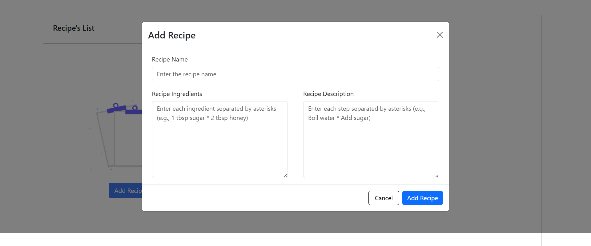

🍲 Recipe-Food-Info-Display

The Recipe-Food-Info-Display is a web application designed to make exploring recipes and food details both engaging and intuitive.A simple Recipe Food Info Display where we can add, edit, delete, Update and shows the recipe incridents and description. Whether you're a cooking enthusiast or just curious about food, this project serves as your go-to platform to:

✨ Features

🔍 Explore Recipes: Find a wide range of recipes with step-by-step preparation guidance.

🥗 Learn Ingredients: View detailed lists of ingredients for every recipe.

📋 Ingredient Lists: Get a detailed breakdown of ingredients for every dish.

📊 Nutritional Insights: Access key nutritional facts to make informed choices and Make informed decisions with key nutrition facts.

💡 Easy Navigation: Experience a clean and intuitive UI for seamless browsing.

🌟 Discover Recipes: Explore a variety of dishes with step-by-step instructions.

🔧 Built With:

React.js: For building a dynamic and responsive user interface.

CSS/Bootstrap: For designing a visually appealing layout.

"Visit here : https://recipe-food-info-display.vercel.app/ "

